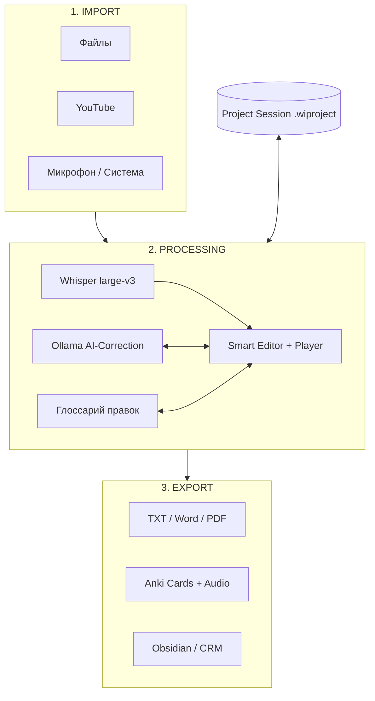

### Текущий фокус: "Умный Редактор" и масштабируемая архитектура (Phase 2)

Основная задача — создать надежный фундамент для 3-этапного рабочего процесса. Мы проектируем среду, которая станет единым центром управления для импорта звука, ИИ-коррекции и генерации обучающего контента.

### Архитектура конвейера (3-Stage Pipeline)

### Детали реализации компонентов

1. **STAGE 1: IMPORT (Data In)**
  - Подготовка модулей для захвата звука (Mic/System) и загрузки из сети (YouTube).
  - *Groundwork*: Использование абстрактного класса `AudioSource` для всех видов импорта.
2. **STAGE 2: PROCESSING (The Hub)**
  - Связка Whisper + Ollama + Интерактивный редактор.
  - *AI Learning*: Создание механизма обратной связи (правка пользователя -> обновление локального словаря).
  - *Playback*: Плеер с Waveform и функцией Play-at-line для каждой строки.
3. **STAGE 3: EXPORT (Value Out)**
  - Модуль постобработки (перевод, рерайт, Anki-карточки).
  - *Anki Work*: Автоматическое вырезание аудио-фрагмента из исходного файла для карточки.

### Менеджер сессий (Centralized State)

Файл сессии (`.wiproject`) станет "единым источником истины". Он будет хранить:

- Пути к локальным аудио-ресурсам.
- Полный транскрипт с таймлайнами и историей правок.
- Глоссарий "незнакомых слов" и пометки для экспорта.

### Используемые библиотеки (расширенный список)

- `requests` (Ollama API), `yt-dlp` (YouTube), `pyaudio` (Mic capture), `python-docx` (Word), `difflib` (Diffing).

