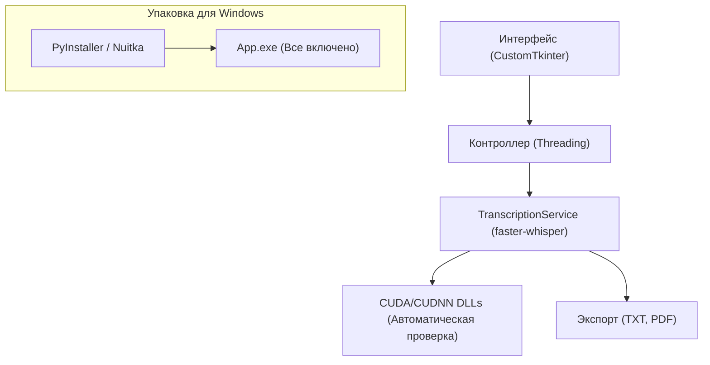

Я предлагаю использовать современный стек на базе Python (CustomTkinter), так как это обеспечит максимальную скорость разработки через Cursor и позволит упаковать все зависимости в один EXE-файл.

### Архитектура приложения

### Основные компоненты

1. **Ядро (TranscriptionService):**
  - Вынос логики из `test.py` в отдельный класс.
  - Автоматическая настройка путей к DLL (чтобы пользователю не нужно было ничего настраивать).
  - Механизм обратных вызовов (callbacks) для обновления прогресса в UI.
2. **Интерфейс (GUI):**
  - Выбор файла (Drag-and-Drop или кнопка Обзор).
  - Выбор модели (tiny, base, small, medium, large-v3).
  - Шкала прогресса (ProgressBar) и статусная строка.
  - Кнопки экспорта в TXT и PDF.
3. **Автономность (Portable EXE):**
  - Включение необходимых CUDA DLL в сборку.
  - Автоматическое скачивание моделей во внутренний кэш при первом запуске.

### Используемые библиотеки

- `faster-whisper` - для ИИ транскрибации.
- `customtkinter` - для современного темного интерфейса в стиле Windows 11.
- `fpdf2` - для генерации PDF с поддержкой арабского и русского языков.
- `pyinstaller` - для сборки в исполняемый файл.

